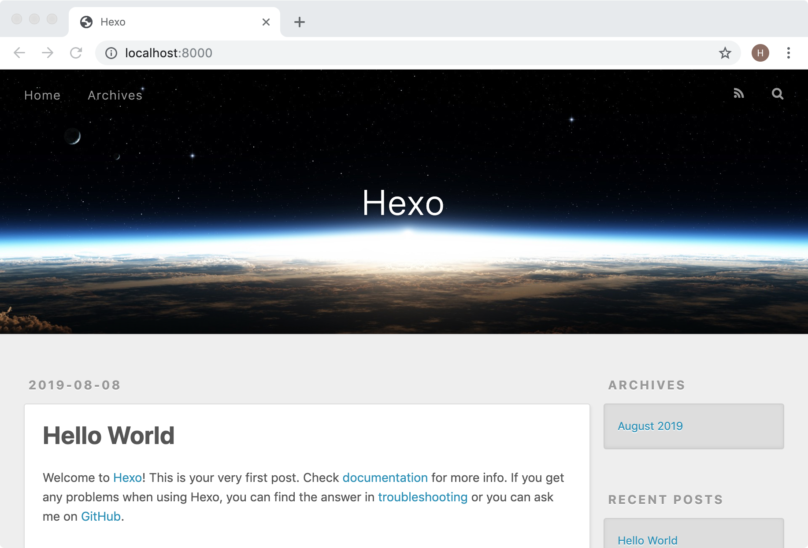
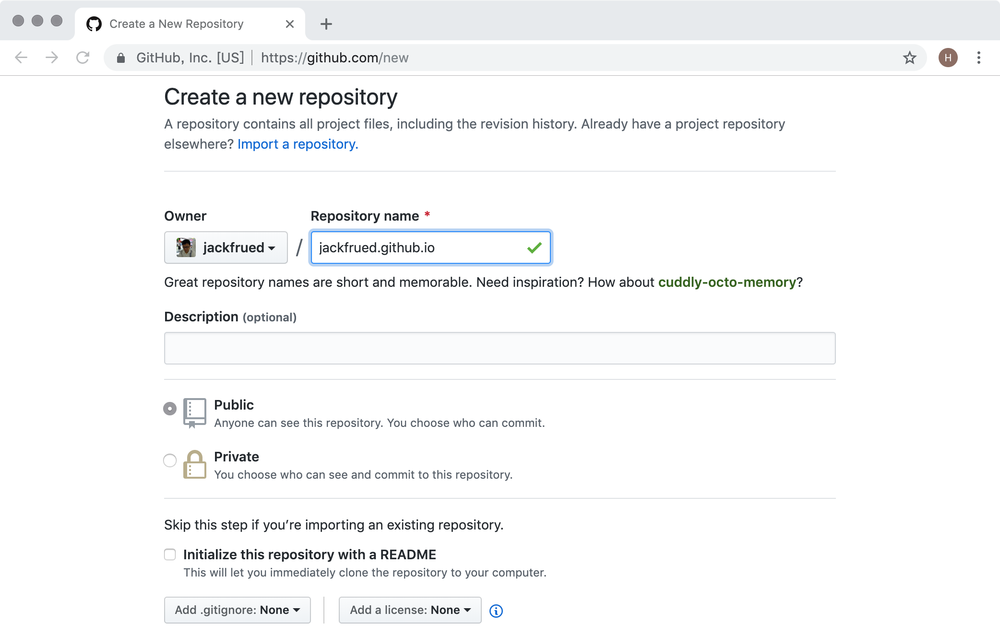
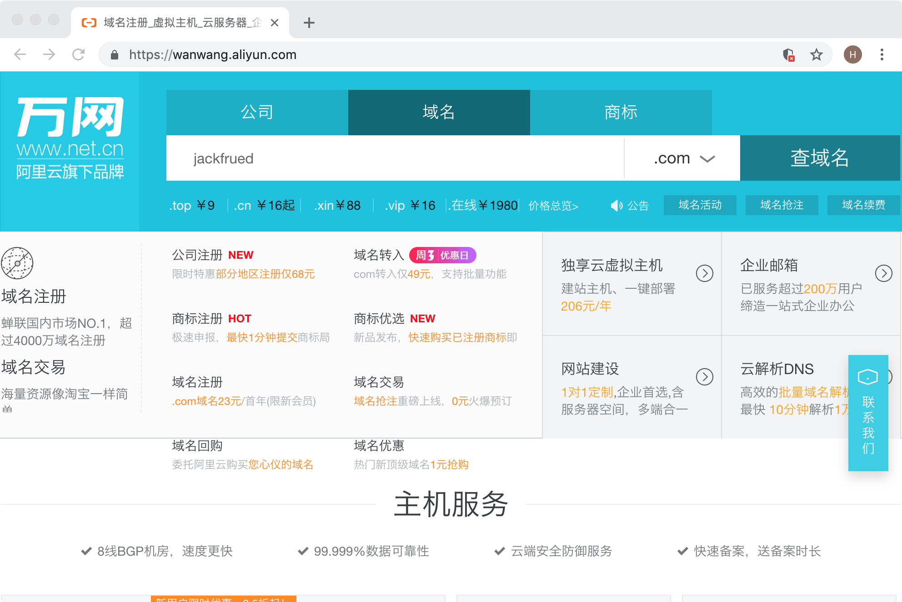

## Building Your Own Blog with Hexo

For a programmer, building a personal blog platform is a very meaningful endeavor. First, a blog can document your growth journey and serve as a summary and reflection of your learning and work over a period of time. Second, through a blog you can market yourself, increase your influence on the internet and within your industry, and lay a solid foundation for a better career in the future. A few years ago, there was a bestselling book called *Soft Skills: The Software Developer's Life Manual*. I remember a passage from it: "The musical talent of a popular band may not be much greater than that of a nightclub house band. So why can they tour the world and create one platinum record after another? ... The better your marketing, the more your talent can shine."

While we're on the subject, let me add a few words. In today's highly developed internet era, how should we market ourselves? Self-marketing starts with building a personal brand, and for programmers, the easiest thing to do well is to build your own blog. A blog serves as your base on the internet. Especially when you have your own independent blog, you can do many things you want to do - you can convey your ideas, enhance your influence, and of course, if your blog does really well, you can profit from it. Besides blogging, live streaming, video platforms, contributing articles, writing books, and participating in tech events are all viable self-marketing approaches. Of course, self-marketing also requires persistence - you won't get far by fishing for three days and drying nets for two.

### Hexo Overview

Hexo is a fast, simple, and efficient blog framework that can render [Markdown](<https://zh.wikipedia.org/zh-hans/Markdown>) documents into beautiful web pages, allowing us to quickly create static website content in a very short time. The Markdown format should not be unfamiliar to programmers. To use Hexo to build your own blog, I really can't think of any tutorial better than the [official documentation](<https://hexo.io/zh-cn/>). I strongly recommend reading the official documentation to learn about Hexo. Below, I'll only provide a brief usage guide.

> Note: **Markdown** is a lightweight markup language that allows people to write documents in an easy-to-read, easy-to-write plain text format. It also supports images, charts, and mathematical formulas. It can be used to write e-books, software documentation, etc., and can be conveniently converted to HTML pages or PDF documents.

To use Hexo, you first need to ensure that [node.js](<https://nodejs.org/en/>) and [git](<https://git-scm.com/>) are installed on your computer. The former is an environment that can run JavaScript code on the server side, and the latter is a version control tool. Installing node.js is mainly for using its package manager npm, so you don't need to systematically learn node.js first. Installing git is for cloning code using the version control system and hosting your blog project on a third-party platform. If you want to learn git, the best resources are [*Git Pro*](<https://git-scm.com/book/zh/v2>) on the official website and [*"Git: The Definitive Guide"*](<http://www.worldhello.net/gotgit/index.html>). After installation, we can use the following commands to verify that the node.js environment and its package manager are installed successfully.

```Shell
node --version
npm --version
```

You can use the following command to check if the git environment is installed.

```Shell
git --version
```

We can use npm to install Hexo. npm is the package manager for node.js, similar in function to Python's pip tool, and can be used to install dependency libraries and third-party tools. When using npm for the first time, we can change the npm download source to a domestic Taobao mirror, which will significantly speed up downloads.

```Shell
npm config set registry https://registry.npm.taobao.org
```

Next, we install Hexo via npm with the following command.

```Shell
npm install -g hexo-cli
```

After successful installation, you can start using Hexo to create your own blog!

### Setting Up the Blog

> Note: The following content is largely based on the Hexo official documentation. We recommend reading the official documentation.

First, we create a folder dedicated to the blog project using the following command. This command will clone the blog project and default theme from GitHub.

```Shell
hexo init blog
```

Next, we enter this folder and view the directory structure.

```Shell
cd blog
ls -lR
```

```
total 232
-rw-r--r--    1 Hao  staff    1768  8  8 01:15 _config.yml
drwxr-xr-x  274 Hao  staff    8768  8  8 01:19 node_modules
-rw-r--r--    1 Hao  staff  109972  8  8 01:19 package-lock.json
-rw-r--r--    1 Hao  staff     443  8  8 01:15 package.json
drwxr-xr-x    5 Hao  staff     160  8  8 01:15 scaffolds
drwxr-xr-x    3 Hao  staff      96  8  8 01:15 source
drwxr-xr-x    3 Hao  staff      96  8  8 01:15 themes
```

> Note: On Windows, you can use the `dir` command in the command prompt to view the directory structure. It should be noted that: `_config.yml` is the blog project's configuration file; `package.json` is the project's dependency file; `scaffolds` contains Markdown file templates, which are the default content filled into newly added Markdown files; the `source` directory contains a subdirectory called `_post`, where we can later place our written Markdown files. Hexo will process these Markdown files into static blog pages, and the generated static pages will be placed in the `public` directory; the `themes` folder stores the themes used by the blog.

Then we install the project's required dependencies (specified in the `package.json` file) using the following command.

```Shell
npm install
```

After completing the above steps, we can directly generate the blog using the following command.

```Shell
hexo generate
```

This command can also be abbreviated as:

```Shell
hexo g
```

When we installed the dependencies earlier, one of them was called `hexo-server`. This dependency helps us start a node.js-based server to run our blog project. Use the following command to start the server.

```Shell
hexo server
```

This command can also be abbreviated as:

```Shell
hexo s
```

```
INFO  Start processing
INFO  Hexo is running at http://localhost:4000 . Press Ctrl+C to stop.
```

From the command output, we can see that the server is running on port 4000 and can be stopped with `Ctrl+C`. If you want to change the port the server uses, add the `-p` parameter when starting the server. If you want the server to automatically open the default browser to access it after starting, use the `-o` parameter, as shown below.

```Shell
hexo s -p 8000 -o
```

At this point, we can see the homepage generated by Hexo without any configuration or custom Markdown files, as shown in the image below.



Next, we modify the blog's configuration file.

```Shell
vim _config.yml
```

```YAML
# Hexo Configuration
## Docs: https://hexo.io/docs/configuration.html
## Source: https://github.com/hexojs/hexo/

# Site
title: Luo Hao's Tech Blog
subtitle: Teaching, sharing knowledge, and the joy it brings
description:
keywords:
author: Luo Hao
language: zh
timezone:

# URL
## If your site is put in a subdirectory, set url as 'http://yoursite.com/child' and root as '/child/'
url: http://jackfrued.top
root: /
permalink: :year/:month/:day/:title/
permalink_defaults:

# Directory
source_dir: source
public_dir: public
tag_dir: tags
archive_dir: archives
category_dir: categories
code_dir: downloads/code
i18n_dir: :lang
skip_render:

# Writing
new_post_name: :title.md # File name of new posts
default_layout: post
titlecase: false # Transform title into titlecase
external_link: true # Open external links in new tab
filename_case: 0
render_drafts: false
post_asset_folder: false
relative_link: false
future: true
highlight:
  enable: true
  line_number: true
  auto_detect: false
  tab_replace:

# Home page setting
# path: Root path for your blogs index page. (default = '')
# per_page: Posts displayed per page. (0 = disable pagination)
# order_by: Posts order. (Order by date descending by default)
index_generator:
  path: ''
  per_page: 10
  order_by: -date

# Category & Tag
default_category: uncategorized
category_map:
tag_map:

# Date / Time format
## Hexo uses Moment.js to parse and display date
## You can customize the date format as defined in
## http://momentjs.com/docs/#/displaying/format/
date_format: YYYY-MM-DD
time_format: HH:mm:ss

# Pagination
## Set per_page to 0 to disable pagination
per_page: 10
pagination_dir: page

# Extensions
## Plugins: https://hexo.io/plugins/
## Themes: https://hexo.io/themes/
theme: landscape

# Deployment
## Docs: https://hexo.io/docs/deployment.html
deploy:
  type:
```

Below is a description of the relevant options in the YAML file.

| Parameter          | Description                                                  |
| ------------------ | ------------------------------------------------------------ |
| `title`            | Website title                                                |
| `subtitle`         | Website subtitle                                             |
| `description`      | Website description                                          |
| `keywords`         | Website keywords, multiple keywords separated by commas      |
| `author`           | Your name                                                    |
| `language`         | Language used by the website                                 |
| `timezone`         | Timezone used by the website, defaults to the computer's timezone |
| `url`              | URL                                                          |
| `root`             | Website root directory                                       |
| `source_dir`       | Source folder for storing content, defaults to the source directory |
| `public_dir`       | Public folder for storing generated site files, defaults to the public directory |
| `tag_dir`          | Tag folder, defaults to the tags directory                   |
| `archive_dir`      | Archive folder, defaults to the archives directory           |
| `category_dir`     | Category folder, defaults to the categories directory        |
| `auto_spacing`     | Add spaces between Chinese and English text, defaults to false |
| `titlecase`        | Transform titles to title case, defaults to false            |
| `external_link`    | Open links in a new tab, defaults to true                    |
| `relative_link`    | Make links relative to the root directory, defaults to false |
| `default_category` | Default category                                             |
| `date_format`      | Date format, defaults to YYYY-MM-DD                          |
| `time_format`      | Time format, defaults to HH:mm:ss                            |
| `per_page`         | Number of articles displayed per page, defaults to 10, 0 disables pagination |
| `pagination_dir`   | Pagination directory, defaults to the page directory         |
| `theme`            | Current theme name                                           |
| `deploy`           | Deployment settings                                          |

We can copy our written Markdown files to the `source/_posts` directory. We can add Front-matter at the top of each Markdown file to specify information such as layout, title, categories, tags, publish date, etc. Front-matter is the area at the very top of each Markdown file separated by `---`. You can set the following content in the Front-matter.

| Parameter    | Description                        | Default Value          |
| ------------ | ---------------------------------- | ---------------------- |
| `layout`     | Layout                             |                        |
| `title`      | Title                              |                        |
| `date`       | Creation date                      | File creation date     |
| `updated`    | Update date                        | File update date       |
| `comments`   | Enable comments for the article    | true                   |
| `tags`       | Tags (not for pagination)          |                        |
| `categories` | Categories (not for pagination)    |                        |
| `permalink`  | Override article URL               |                        |

For example:

```Markdown
---
title: Python Programming Idioms
categories:
- Python Basics
tags:
- Python
- PEP8
date: 2019-8-1
---
## Python Idioms

The word "idiom" refers to a habitual practice, a conventional approach, or a customary way of doing things. Since Python differs significantly from many other programming languages in both syntax and usage, a Python developer who fails to master these idioms will not be able to write "Pythonic" code. Below, we summarize some idiomatic code patterns commonly used in Python development.

1. Make code both importable and executable.
   if __name__ == '__main__':

2. Use the following approach to check for logical "true" or "false".
   if x:
   if not x:
```


After completing the above work, we can clean up previously generated content using the following command.

```Shell
hexo clean
```

Then we can regenerate and run the blog project using the commands we learned earlier.

```Shell
hexo generate
hexo server -p 8000 -o
```

### Hosting the Blog on GitHub

We can use the [Pages](<https://pages.github.com/>) service provided by GitHub to host our blog. On the GitHub Pages homepage, there is a tutorial guiding us on how to host our website. Of course, the first step is to register a GitHub account, and you need to be logged in to proceed with the following steps.

1. Create a repository based on your username. The repository **must** be named "username.github.io". For example: my GitHub username is jackfrued, so my blog hosting repository must be named jackfrued.github.io.

   

2. Modify the blog project's configuration file `_config.yml` to configure GitHub as the deployment target.

   ```Shell
   vim _config.yml
   ```

   ```YAML
   # Content above omitted
   # Deployment
   ## Docs: https://hexo.io/docs/deployment.html
   deploy:
     type: git
     repo: https://github.com/jackfrued/jackfrued.github.io.git
     branch: master
   ```

   In the configuration above, type specifies using git for project deployment, repo specifies the URL of the git repository for deployment (we're using an HTTPS address here; if you've previously configured SSH key pairs, you can also use an SSH address), and branch specifies which branch to sync the code to. Usually the master branch is the branch for publishing the project's final work product, also known as the project's main branch.

3. Install the deployer plugin called `hexo-deployer-git`, which enables one-click deployment.

   ```Shell
   npm install hexo-deployer-git --save
   ```

4. Use the following command for one-click deployment to GitHub.

   ```Shell
   hexo deploy -g
   ```

   or

   ```Shell
   hexo generate -d
   ```

5. Now enter [jackfrued.github.io](https://jackfrued.github.io) in your browser to see your blog. People from all over the world can now access your blog through this URL. You may have noticed that the URL for accessing your blog is the same as the repository name we just created. Since your GitHub username is unique, this domain name is also unique worldwide.

### Binding the Blog to Your Own Domain

Although we can already access our blog through the domain provided by GitHub, if we don't want to be "under someone else's roof," we can bind the blog to our own exclusive domain while still using GitHub Pages' hosting service. If you haven't purchased a domain yet, you can buy one from websites that offer domain registration services (such as [Wanwang](<https://www.hichina.com/>) or [GoDaddy](<https://www.godaddy.com/>)).



> **Note**: Currently, domain management in China is becoming increasingly strict. When purchasing a domain, you need to fill in a large amount of personal information and complete real-name verification before obtaining the domain, which is understandable.

For example, suppose I've already purchased a domain called "jackfrued.top." How do we bind it to "jackfrued.github.io"? We can use the [Alibaba Cloud Console](<https://dns.console.aliyun.com/>) or [DNSPod](<https://www.dnspod.cn/>) to set up a DNS resolution service. After logging into the DNS resolution platform, you can add or select your domain to configure DNS resolution. Click the "Add Record" button to create a CNAME type DNS record. A CNAME record resolves one domain to another domain, as shown in the image below.


After completing this step, you still can't immediately access the blog project through your own domain. Finally, you need to add a file named CNAME to the `source` directory of the blog project (note that the filename is in all uppercase letters). The content of this file is as follows.

```
jackfrued.top
```

You can clean up the previously generated content, then regenerate and publish the project to GitHub, and you're all done! Now we have a blog with our own domain. We hope everyone can use it to do meaningful things (document your growth journey, share your work experience, enhance your personal influence).

Keep going, programmers!
