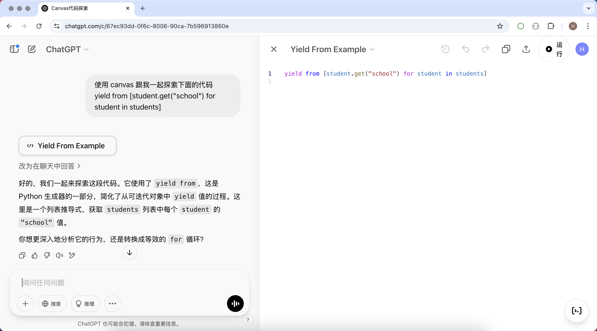
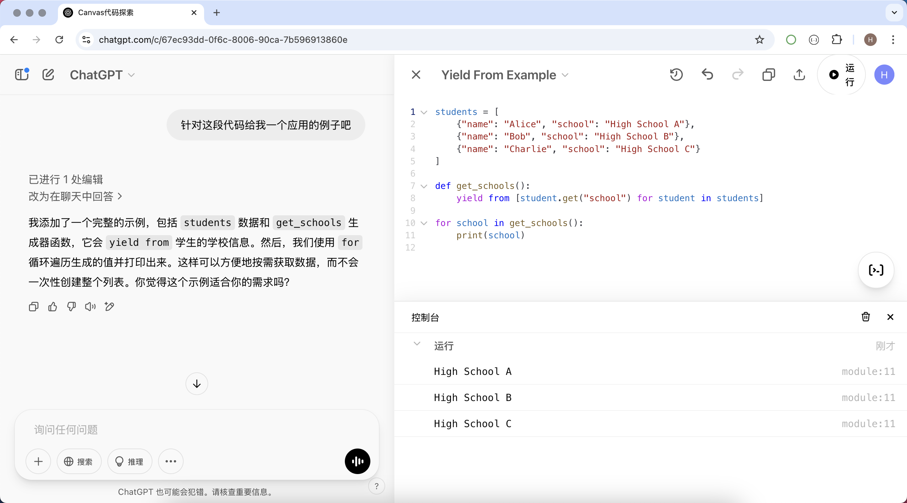

## Learning Programming with Canvas

When learning programming, we often need to write, modify, and optimize code. ChatGPT's Canvas feature provides an efficient and intuitive way to help us better understand and improve our coding skills. Below, we briefly introduce how to use ChatGPT's Canvas feature for learning and understanding code.

### Canvas Use Cases

#### 1. Real-time Code Editing and Optimization

The Canvas feature can serve as an interactive code editor, allowing us to write code directly within it and make real-time modifications and optimizations. When we encounter code issues, we can submit code in Canvas and request optimization suggestions from ChatGPT. For example:

- Refactor code through ChatGPT to make it more concise and readable.
- Have ChatGPT explain the logic of a piece of code to help understand complex algorithms or design patterns.
- Iteratively improve code in Canvas to enhance execution efficiency or reduce redundant code.

#### 2. Learning Programming Concepts and Examples

For beginners, Canvas is also an excellent learning tool. You can enter example code in Canvas and have ChatGPT explain what it does. For example:

- Learn basic syntax such as variables, loops, functions, etc.
- Learn data structures and algorithms through example code, such as linked lists, sorting algorithms, etc.
- Have ChatGPT provide code examples and explain how the code runs line by line.

#### 3. Code Debugging and Error Correction

Errors are inevitable during programming. Canvas can help quickly locate and fix errors.

- Paste buggy code into Canvas and have ChatGPT analyze the cause of the error.
- Have ChatGPT provide a fix and explain why the error occurred.
- Debug iteratively through Canvas to gradually optimize the code logic.

#### 4. Code Comments and Documentation Generation

Writing clear comments and documentation is crucial for code readability. Canvas can help us quickly generate code comments and documentation:

- Have ChatGPT add detailed comments to the code for easier future maintenance and understanding.
- Automatically generate API documentation to facilitate team collaboration.
- Generate brief descriptions of the code execution flow to help quickly grasp the code logic.

### Canvas Application Examples

```python
yield from [student.get("school") for student in students]
```

While learning Python, if you see the code above but don't understand its intent, you can start a conversation with ChatGPT using the following prompt. You don't even need to tell it which programming language you're using, nor provide any context for the code.

```
Use canvas to explore the following code with me
yield from [student.get("school") for student in students]
```

As shown in the image below, ChatGPT provided a response about the code above, with Canvas expanded on the right side containing our code.



If the response above still didn't help you understand the code, we can ask ChatGPT to provide a corresponding example with the following prompt.

```
Give me a practical example for this code
```

As shown in the image below, ChatGPT has already modified the code in Canvas and provided a complete, runnable Python program. We can click the run button on Canvas to execute this code. Canvas currently supports many programming languages, and it should be familiar with the programming language you know.



If you understood the operation above, we can continue to ask questions, such as how to modify the code if the `"school"` field doesn't exist.

```
Modify the code above to make the generator exclude students without a school
```


Then, we can further ask ChatGPT to modify the code according to our actual needs.

```
How should I modify it if I want each school to appear only once
```


For Python developers, if you think the code generated by ChatGPT isn't concise or Pythonic enough, we can continue asking.

```
Can the code above be written more concisely and Pythonically
```


### Summary

ChatGPT's Canvas feature is not just a code editor, but an intelligent programming assistant. Whether you are a programming beginner or an experienced developer, you can improve your code comprehension and writing skills through Canvas. Through continuous practice and exploration, you can master programming techniques more efficiently and enhance your technical skills.
