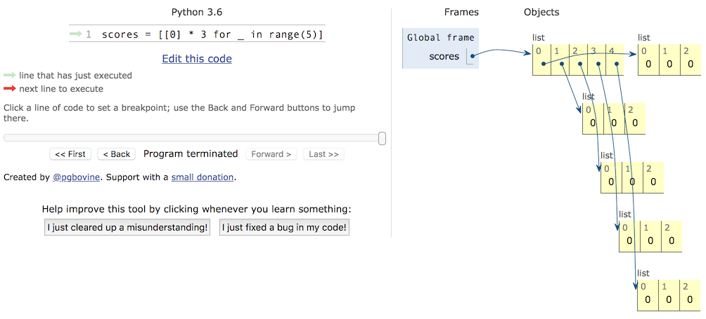

## The Pitfalls We've Stumbled Into Over the Years

### Pitfall 1 - Integer Comparison

In Python, everything is an object, including integers. When comparing two integers, there are two operators: `==` and `is`. The difference is:

- `is` compares whether the `id` values of two integer objects are equal, meaning it checks whether two references point to the same memory address.
- `==` compares whether the content of two integer objects is equal. Using `==` actually calls the object's `__eq__()` method.

Now that we know the difference between `is` and `==`, let's look at the code below to understand the pitfalls of integer comparison in Python. **Using the CPython interpreter as an example**, take a look at the following code.

```Python
def main():
	x = y = -1
	while True:
		x += 1
		y += 1
		if x is y:
			print('%d is %d' % (x, y))
		else:
			print('Attention! %d is not %d' % (x, y))
			break

	x = y = 0
	while True:
		x -= 1
		y -= 1
		if x is y:
			print('%d is %d' % (x, y))
		else:
			print('Attention! %d is not %d' % (x, y))
			break


if __name__ == '__main__':
	main()
```

Part of the output of the code above is shown in the image below. This result occurs because CPython, for performance optimization, caches frequently used integer objects in an object pool called `small_ints`. The `small_ints` cache covers integers in the range `[-5, 256]`. This means that when using the CPython interpreter, anywhere these integers are referenced, no new `int` object needs to be created - it directly references the object in the cache pool. If an integer falls outside this range, then even if two integers have the same value, they are different objects.


Of course, if this were the only issue, it wouldn't be much of a pitfall. If you understand the rule above, let's look at the following code.

```Python
a = 257


def main():
	b = 257  # Line 6
	c = 257  # Line 7
	print(b is c)  # True
	print(a is b)  # False
	print(a is c)  # False


if __name__ == "__main__":
	main()
```

The execution results are already written as comments in the code. Quite tricky, right? At first glance, the values of `a`, `b`, and `c` are all the same, but the `is` comparison yields different results. Why does this happen? First, let's talk about code blocks in Python programs. A code block is the smallest basic unit of execution in a program. A module file, a function body, a class, and a single line of code in an interactive interpreter are all considered code blocks. The code above consists of two code blocks: `a = 257` is one code block, and the `main` function is another. To further improve performance, CPython has an additional rule: for integers within the same code block whose values fall outside the `small_ints` cache range, if an integer object with the same value already exists in the same code block, it directly references that object; otherwise, it creates a new `int` object. Note that this rule applies to numeric types, but for strings, the string length needs to be considered - you can verify this on your own.

To verify this conclusion, we can use the `dis` module (as the name suggests, it's for disassembly) to examine this code from the bytecode perspective. If you don't understand what bytecode is, you can first read the article [*"Understanding How Python Programs Run"*]((http://www.cnblogs.com/restran/p/4903056.html)). You can import the `dis` module with `import dis` and modify the code as follows.

```Python
import dis

dis.dis(main)
```

The execution result is shown in the image below. You can see that lines 6 and 7 of the code, which are the 257 values in the `main` function, are loaded from the same location, meaning they are the same object. However, the `a` on line 9 is clearly loaded from a different place, meaning it references a different object.


If you want to dig deeper into this topic, I recommend reading the article [*"Python Integer Object Implementation Principles"*](https://foofish.net/python_int_implement.html).

### Pitfall 2 - Nested Lists

Python has a built-in data type called a list. It's a container that can hold other objects (more precisely, references to other objects). The objects in a list are called elements of the list. Obviously, we can use a list as an element of another list - this is called a nested list. Nested lists can be used to simulate real-world tables, matrices, 2D game maps (like the garden in Plants vs. Zombies), game boards (like chess or Othello), etc. However, be careful when using nested lists, or you may encounter very awkward situations. Here's a small example.

```Python
names = ['Guan Yu', 'Zhang Fei', 'Zhao Yun', 'Ma Chao', 'Huang Zhong']
subjs = ['Chinese', 'Math', 'English']
scores = [[0] * 3] * 5
for row, name in enumerate(names):
    print('Please enter scores for %s' % name)
    for col, subj in enumerate(subjs):
        scores[row][col] = float(input(subj + ': '))
        print(scores)
```

We want to enter scores for 5 students across 3 courses. So we define a list with 5 elements, where each element is itself a list containing 3 elements. This list of lists corresponds to a table with 5 rows and 3 columns. Then we use nested for-in loops to input each student's scores for the 3 courses. After the program finishes, we find that all 5 students have identical scores for all 3 courses, and those scores are just the ones entered for the last student.

To fix this pitfall, we first need to distinguish between objects and references to objects. To understand this distinction, we need to talk about the stack and heap in memory. We often hear people mention "stack memory," but in reality, the "heap" and "stack" are two different concepts. As we all know, when a program runs, it needs memory to store data and code. This memory can be further logically divided. Programmers familiar with low-level languages (such as C) know that the memory available to a program can be logically divided into five parts, from high to low addresses: stack, heap, data segment, static area (read-only data segment), and code segment. The stack is used to store local and temporary variables, as well as data needed for saving and restoring context during function calls. This memory is automatically allocated when a code block starts executing and automatically freed when execution ends, typically managed by the compiler. The heap has a variable size and can be dynamically allocated and reclaimed. If a program has a large amount of data to process, the data is typically placed on the heap. If heap space is not properly freed, it leads to memory leaks. Languages like Python and Java use garbage collection mechanisms to implement automatic memory management (automatically reclaiming heap space that is no longer used). So in the code below, variable `a` is not the actual object - it's a reference to the object, essentially recording the object's address in heap space, through which we can access the corresponding object. Similarly, variable `b` is a reference to a list container in heap space, and the list container itself doesn't hold the actual objects - it only holds references to objects.

 ```Python
a = object()
b = ['apple', 'pitaya', 'grape']
 ```

Knowing this, we can look back at the program. When we perform `[[0] * 3] * 5`, we're only copying the address of `[0, 0, 0]` - we're not creating new list objects. So although the container has 5 elements, all 5 elements reference the same list object. This can be verified by using the `id` function to check the addresses of `scores[0]` and `scores[1]`. The correct code should be modified as follows.

```Python
names = ['Guan Yu', 'Zhang Fei', 'Zhao Yun', 'Ma Chao', 'Huang Zhong']
subjs = ['Chinese', 'Math', 'English']
scores = [[]] * 5
for row, name in enumerate(names):
    print('Please enter scores for %s' % name)
    scores[row] = [0] * 3
    for col, subj in enumerate(subjs):
        scores[row][col] = float(input(subj + ': '))
        print(scores)
```

or

```Python
names = ['Guan Yu', 'Zhang Fei', 'Zhao Yun', 'Ma Chao', 'Huang Zhong']
subjs = ['Chinese', 'Math', 'English']
scores = [[0] * 3 for _ in range(5)]
for row, name in enumerate(names):
    print('Please enter scores for %s' % name)
    scores[row] = [0] * 3
    for col, subj in enumerate(subjs):
        scores[row][col] = float(input(subj + ': '))
        print(scores)
```

If you're having trouble understanding memory usage, check out the code visualization feature provided by the [PythonTutor website](http://www.pythontutor.com/). Through visualization, we can see how memory is allocated, helping us avoid pitfalls when using nested lists or copying objects.




### Pitfall 3 - Access Modifiers

Anyone who has done object-oriented programming in Python knows that Python classes provide two levels of access control: public and private (adding double underscores before an attribute or method). Those accustomed to Java or C# know that class attributes (data abstraction) are usually private - the purpose being to protect the data - while class methods (behavior abstraction) are usually public, since methods are the services an object provides to the outside world. However, Python does not enforce the privacy of private members at the syntax level. It merely performs name mangling on so-called private members of a class. If you know the naming rules, you can still directly access private members. See the code below.

```Python
class Student(object):

    def __init__(self, name, age):
        self.__name = name
        self.__age = age

    def __str__(self):
        return self.__name + ': ' + str(self.__age)


stu = Student('Luo Hao', 38)
print(stu._Student__name)
print(stu._Student__age)
```

Why does Python have this design? A widely circulated maxim explains this well: "We are all consenting adults here." This statement expresses a common view among many Python programmers: openness is better than closure. We should take responsibility for our own actions rather than restricting access to data or methods at the language level.

So in Python, there's really no need to use double-underscore prefixed naming to make class attributes or methods private, because it doesn't serve any real purpose. If you want to protect attributes or methods, we recommend using single-underscore prefixed protected members. Although they also can't truly protect these attributes or methods, they serve as a hint to callers that these are attributes or methods that should not be accessed directly. Furthermore, this approach doesn't prevent subclasses from inheriting these members.

One important thing to note is that the magic methods in Python classes, such as `__str__`, `__repr__`, etc., are NOT private members. Although they start with double underscores, they also end with double underscores. This naming convention does not indicate private members - a fact that can be quite confusing for beginners.
