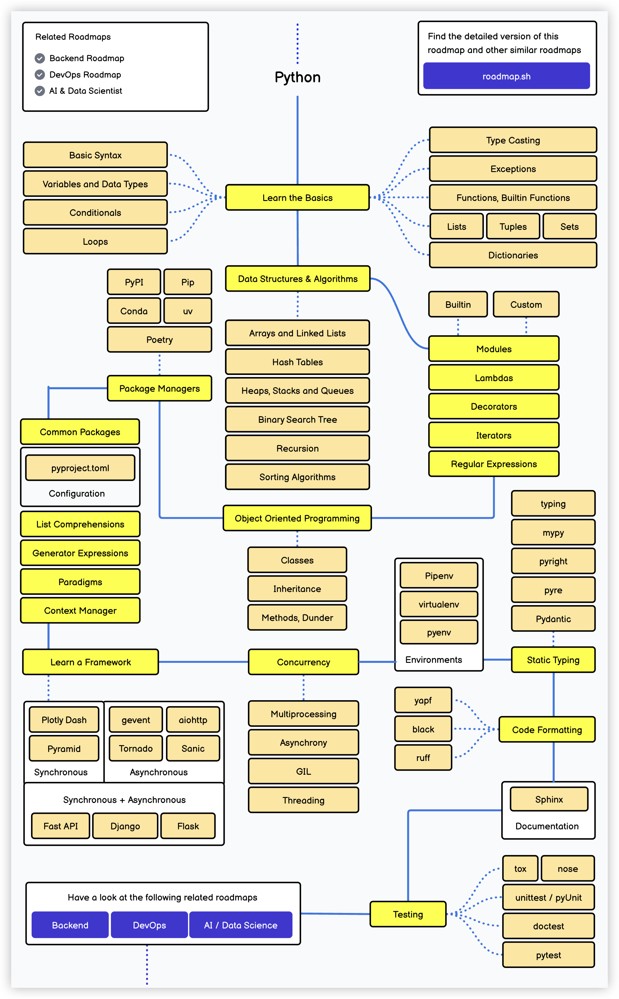
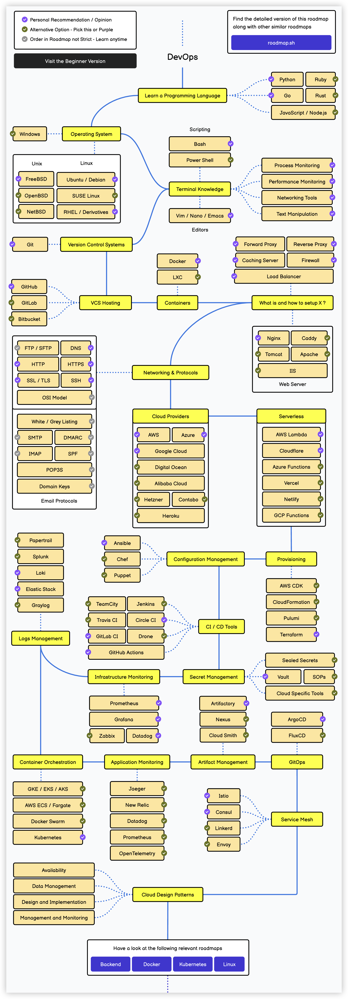
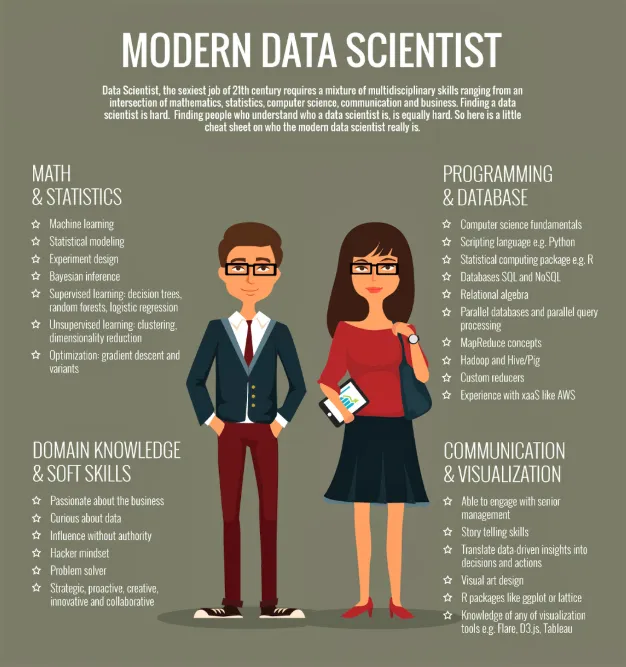

## Sharing Some Learning Roadmaps

Today I browsed a website called [Developer Roadmaps](https://roadmap.sh), which has many learning roadmaps. Among them, there's a pretty good Python learning roadmap that I'd like to share with everyone. If you use Python for engineering development (backend development, API development, application development, etc.), the content on this roadmap is basically everything you'll need to cover. If you're only using Python as an auxiliary tool, studying the 20 lessons from [*"Learn Python from Scratch"*](https://www.zhihu.com/column/c_1216656665569013760) that I compiled earlier should be more than enough. Recently, I've been revising the content of these 20 lessons, and the revised content will be marked as "2025 Edition." I also hope to hear your opinions and suggestions during this process.

Here are three related learning roadmaps: Backend Development, DevOps, and Data Science. The backend development learning roadmap is shown below. The content is quite extensive, with Java or Go as the core programming languages. I personally don't recommend using Python for backend development. If you've already mastered Python well and have substantial knowledge of computer science, you can try the AI application development track - I believe you'll gain much more from it. Pay attention to the items checked in purple; these are the author's recommended options, and most of them are also what I would recommend for backend developers to learn.

Let's take a look at the DevOps learning roadmap. DevOps is currently a hot position in the job market, and those who are interested should check it out.

If you've learned some Python-related knowledge and want to use it as a foundation for transitioning into data analysis, take a look at the learning roadmap below. It should be noted that Python is merely a tool for doing data analysis. To become an excellent data analyst, you need good data thinking and sufficient accumulated business knowledge. Only then can you generate business insights from data, use data to optimize products, drive business, and truly provide strong support for decision-making.

Finally, a reminder: if you want to commit to a daily study routine, make sure to leave me a comment in the [comments section](https://zhuanlan.zhihu.com/p/23821670129)! If you want to **dive into data science** (data analysis, data mining, data governance, etc.), you can also leave me a message. I should be continuously producing related content this year.

