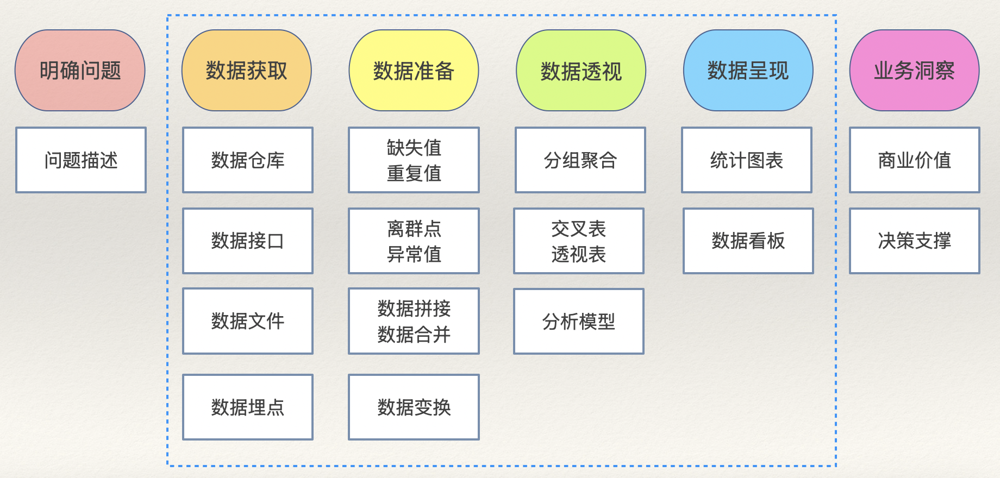

## How to Quickly Master the pandas Library

Recently, some people mentioned that the pandas library for Python data analysis has too many functions and methods, and that learning and using it feels very chaotic. I've addressed this question before, and today I'll organize the answer more systematically. After all, this library plays an extremely important role in the Python data science ecosystem. Although there are now many alternatives to pandas (such as polars, cuDF, etc.), their usage is largely similar to pandas.

### Three Core Classes

The pandas library has three core classes, among which the most important is `DataFrame`, which is the focus of learning, as shown in the figure below.


1. `Series`: Represents one-dimensional data, similar to a one-dimensional array (a labeled array). Each data point has its own index (label), and data can be accessed through the index.
2. `DataFrame`: Represents two-dimensional data, similar to an Excel spreadsheet. Both rows and columns have their own indexes (labels), and rows, columns, and cells can be accessed through indexes.
3. `Index`: Represents an index, providing indexing services for `Series` and `DataFrame`. `Index` has many subtypes suitable for scenarios requiring different types of indexes.

### Data Analysis Workflow

The key to learning and using pandas is the application of `DataFrame`. We recommend mastering the corresponding functions and methods by following the data analysis workflow, which often yields twice the results with half the effort. The data analysis workflow is shown in the figure below, where the part circled by the blue dashed line is what can be accomplished through BI tools (such as Power BI, Tableau, etc.) or Python programs.



#### Data Acquisition

Data acquisition can also be called data loading. Its essence is creating `DataFrame` objects. You need to master the following functions:

1. Loading data from a CSV file.

```python
pd.read_csv(
    filepath,      # CSV file path (can be a local absolute/relative path or a URL)
    sep,           # Field separator (default is comma)
    header,        # Which row contains the header
    encoding,      # File encoding (default utf-8)
    quotechar,     # Character used to wrap strings (default is double quote)
    usecols,       # Which columns to load
    index_col,     # Specify the index column
    dtype,         # Specify column data types
    converters,    # Specify column data converters
    nrows,         # How many rows of data to load
    skiprows,      # Specify rows to skip
    parse_dates,   # Which columns to parse as datetime
    date_format,   # Date format
    true_values,   # Values to be treated as boolean True
    false_values,  # Values to be treated as boolean False
    na_values,     # Values to be treated as null
    na_filter,     # Whether to detect null value markers
    on_bad_lines,  # How to handle problematic rows (options: 'error', 'warn', 'skip')
    engine,        # Specify the underlying engine (e.g., use the faster Arrow engine for larger data)
    iterator,      # Whether to enable iterator mode (reduces memory overhead for large data)
    chunksize,     # Size of each chunk in iterator mode
)
```

2. Loading data from an Excel file.

```python
pd.read_excel(
    io,           # Path to the workbook file
    sheet_name,   # Name of the worksheet
    skip_footer,  # How many rows to skip at the end
)
```

> **Note**: `read_excel` shares many parameters with `read_csv` that serve the same purpose, which are not repeated here. When loading data from an Excel file, there is no iterator mode.

3. Loading data from a database or data warehouse.

```python
pd.read_sql(
    sql,          # SQL query or table name
    con,          # Database connection
    parse_dates,  # Specify columns to parse as dates
    index_col,    # Specify index column
    columns,      # Columns to load
    chunksize,    # Data chunk size
    dtype,        # Specify column data types
)
```

4. Other ways to create `DataFrame` objects.

```python
pd.DataFrame(data=[[95, 87], [66, 78], [92, 89]], index=[1001, 1002, 1003], columns=['Verbal', 'Math'])
pd.DataFrame(data={'Verbal': [95, 66, 92], 'Math': [87, 78, 89]}, index=[1001, 1002, 1003])
```

To operate on the data or indexes in a `DataFrame`, you need to master the following operations and methods.

1. View information

```python
df.info()
```

2. View the first/last N rows

```python
df.head(10)
df.tail(5)
```

3. Access columns

```python
df['column_name']
df.colume_name
```

4. Access rows

```python
df.loc['row_index']
df.iloc[0]
```

5. Access cells

```python
df.at['row_index', 'column_name']
df.iat[0, 0]
```

6. Delete rows or columns

```python
df.drop(
    labels,   # Index of rows or columns to delete
    axis,     # axis=0: labels refers to row index; axis=1: labels refers to column index
    index,    # Index of rows to delete
    columns,  # Index of columns to delete
    inplace,  # Whether to delete in place (inplace=True means delete in place without returning a new DataFrame)
)
```

7. Filter data

```python
df.query(expr)  # Specify filter conditions through expressions
df[bool_index]  # Boolean indexing
```

8. Random sampling

```python
df.sampe(
    n,             # Sample size
    frac,          # Sampling ratio
    replace,       # Sampling with or without replacement (default False)
    random_state,  # Random seed (same seed produces same results each time)
)
```

9. Reset index

```python
df.reset_index(
    level,    # For multi-level indexes, specify which level to reset
    drop,     # Whether to drop the index (drop=False means the index will be converted to a regular column)
    inplace,  # Whether to process in place (whether to return a new DataFrame)
)
```

10. Set index

```python
df.set_index(
   keys,              # Specify columns to use as the index
   drop,              # Whether to drop the column used as index (default True)
   append,            # Whether to append the specified column to the existing index (default False)
   inplace,           # Whether to process in place (whether to return a new DataFrame)
   verify_integrity,  # Check if the index column has duplicate values (default False)
)
```

11. Reorder indexes

```python
df.reindex()
df[fancy_index]       # Fancy indexing
df.loc[facy_index]    # Fancy indexing
df.iloc[fancy_index]  # Fancy indexing
```

12. Sort by index

```python
df.sort_index(
    axis,         # Specify row index or column index (default 0)
    level,        # For multi-level indexes, specify the index level
    ascending,    # Ascending or descending (default True)
    inplace,      # Whether to sort in place
    kind,         # Sorting algorithm (default 'quicksort')
    na_position,  # Put nulls first or last (default 'last')
    key,          # Function to compare index values (custom comparison rules)
)
```


#### Data Reshaping

1. Concatenation (similar to SQL UNION)

```python
pd.concat(
    objs,          # Container holding multiple DataFrame objects
    axis,          # Axis along which to concatenate
    ignore_index,  # Whether to ignore the original index (default False)
)
```

2. Merging (similar to SQL JOIN)

```python
pd.merge(
    left,         # Left table
    right,        # Right table
    how,          # Specify the join method (default 'inner' for inner join)
    on,           # Specify the join column (if both tables have the same column name)
    left_on,      # Specify the left table's join column
    right_on,     # Specify the right table's join column
    left_index,   # Whether to use the left table's index for joining
    right_index,  # Whether to use the right table's index for joining
    suffixes,     # Specify suffixes for columns with the same name (default ('_x', '_y'))
)
```


#### Data Cleaning

1. Missing values

```python
# Identify missing values
df.isna()
df.notna()
# Drop missing values
df.dropna(
    axis,     # Drop rows or columns (default 0)
    how,      # Whether to drop if any missing value exists (default 'any')
    subset,   # Only drop nulls for specific rows or columns
    inplace,  # Whether to drop in place (whether to return a new DataFrame)
)
# Fill missing values
df.fillna(
    value,    # Value to fill with
    method,   # Method for filling null values
    inplace,  # Whether to fill in place (whether to return a new DataFrame)
)
# Interpolate using interpolation algorithms
df.interpolate(
    method,   # Interpolation algorithm (default 'linear' for linear interpolation)
    axis,     # Axis along which to interpolate
    inplace,  # Whether to interpolate in place (whether to return a new DataFrame)
)
```

2. Duplicate values

```python
# Identify duplicates
df.duplicated(
    subset,   # Column labels to use for identifying duplicates
    keep,     # How to handle duplicates (default 'first' keeps the first occurrence)
)
# Remove duplicates
df.drop_duplicates(
    subset,   # Column labels to use for identifying duplicates
    keep,     # How to handle duplicates (default 'first' keeps the first occurrence)
    inplace,  # Whether to deduplicate in place (default False)
)
# Count unique values
df.nunique(axis)
```

3. Outliers

The key to handling outliers is identification. You can use numerical threshold methods, z-score methods, isolation forests, and other methods to identify outlier points, then combine them with actual business meaning to determine whether they are truly anomalous. For handling outliers, the typical approach is replacement or deletion. Deletion can be done using the `drop` method mentioned earlier to drop rows or columns.

```python
# Replace outliers
df.replace(
    to_replace,  # Value to be replaced
    value,       # Replacement value
    inplace,     # Whether to replace in place (whether to return a new DataFrame)
    regex,       # Whether to enable regex replacement (default False)
)
```

4. Preprocessing

Preprocessing typically operates on data at the `Series` level. Assuming variable `s` is a `Series` object, the specific operations include:

- Datetime preprocessing

```python
s.dt.year                   # Year
s.dt.quarter                # Quarter
s.dt.month                  # Month
s.dt.day                    # Day
s.dt.hour                   # Hour
s.dt.minute                 # Minute
s.dt.second                 # Second
s.dt.weekday                # Day of the week
s.dt.to_period(freq)        # Convert to a specific frequency
s.dt.floor(freq)            # Floor
s.dt.ceil(freq)             # Ceil
s.dt.round(freq)            # Round
s.dt.strftime(date_format)  # Format
s.dt.tz_localize(tz)        # Localize timezone
s.dt.tz_convert(tz)         # Convert timezone
```

- String preprocessing

```python
s.str.lower()       # Convert string to lowercase
s.str.upper()       # Convert string to uppercase
s.str.title()       # Capitalize the first letter of each word
# Split string
s.str.split(
    pat,            # Split character or regex pattern
    n,              # Maximum number of splits
    expand,         # Whether to expand split results into multiple columns (default False)
)
# Extract content from string
s.str.extract(
    pat,            # Regex pattern
    flags,          # Regex processing flags
    expand,         # Whether to expand captured content into multiple columns (default True)
)
s.str.isalpha()     # Check if string contains only letters
s.str.isnumeric()   # Check if string is numeric
s.str.isalnum()     # Check if string is alphanumeric
s.str.isspace()     # Check if string contains only whitespace
s.str.startswith()  # Check if string starts with specified content
s.str.endswith()    # Check if string ends with specified content
# Check if string matches a regex pattern
s.str.match(
    pat,            # Regex pattern
    flags,          # Regex processing flags
)
# Check if string contains specified content
s.str.contains(
    pat,            # String or regex pattern
    flags,          # Regex processing flags
    regex,          # Whether to use regex (default True)
)
# Replace
s.str.replace(
    pat,            # Content to be replaced (string or regex)
    repl,           # Replacement content
    n,              # Maximum number of replacements (default -1 means replace all)
    flags,          # Regex processing flags
    regex,          # Whether to use regex (default True)
)
s.str.strip()       # Remove extra whitespace from string
s.str.join(sep)     # Join content into a string with specified separator
# String concatenation
s.str.cat(
    others,         # Content to concatenate
    sep,            # Separator
    na_rep,         # Replacement for null values
)
s.str.len()         # Get string length
# Find substring position
s.str.find(
    sub,            # Substring
    start,          # Start position
    end,            # End position
)
```

- Category preprocessing

```python
# Reorder categories
s.cat.reorder_categories(
    new_categories,  # New category order
    inplace,         # Whether to process in place (default False)
)
# Add categories
s.cat.add_categories(
    new_categories,  # New categories to add
    inplace,         # Whether to process in place (default False)
)
# Remove categories
s.cat.remove_categories(
    removals,        # Categories to remove
    inplace,         # Whether to process in place (default False)
)
# Remove unused categories
s.cat.remove_unused_categories(
    inplace,         # Whether to process in place (default False)
)
# Rename categories
s.cat.rename_categories(
    new_categories,  # New category names
    inplace,         # Whether to process in place (default False)
)
```

- Binarization (dummy variables)

```python
pd.get_dummies(
    data,        # Series or DataFrame to convert to dummy variables
    prefix,      # Prefix for generated dummy variable columns
    prefix_sep,  # Separator between prefix and column name
    dummy_na,    # Whether to generate a column for null values (NaN) (default False)
    columns,     # Specify column names to convert
    drop_first,  # Whether to drop the first category column from generated dummies (default False)
)
```

- Discretization (binning)

```python
pd.cut(
    x,        # Input data to be split (one-dimensional data)
    bins,     # Number of intervals or specific interval boundaries
    right,    # Whether the interval includes the right endpoint (default False)
    labels,   # Labels for each interval
    retbins,  # Whether to return the boundary array (default False)
    ordered,  # Whether the returned categories are ordered (default True)
)
pd.qcut(
    x,        # Input data to be split (one-dimensional data)
    q,        # Number of split points or specific quantiles
    labels,   # Labels for each interval
    retbins,  # Whether to return the boundary array (default False)
)
```

- Custom transformations

```python
s.map(arg)          # Element-level transformation and mapping of data
df.map(func)        # Element-level transformation and mapping of data
# Element-level transformation through a specified function
s.apply(
    func,           # Function to apply to each element
    convert_type,   # Try to convert results to the most appropriate type (default True)
    args,           # Extra positional arguments passed to func
    kwargs,         # Extra keyword arguments passed to func
)
# Row-level or column-level transformation through a specified function
df.apply(
    func,           # Function to apply to rows or columns
    axis,           # Controls row-level or column-level transformation
    result_type,    # Specify return type ('expand' expands into columns, 'reduce' returns scalar, 'broadcast' broadcasts to original shape)
    args,           # Extra positional arguments passed to func
    kwargs,         # Extra keyword arguments passed to func
)
s.transform(func)   # Element-level transformation through one or more specified functions
df.transform(func)  # Row-level or column-level transformation through one or more specified functions
```

#### Data Analysis

1. Descriptive statistics

```python
s.mean()     # Mean
s.median()   # Median
s.mode()     # Mode
s.max()      # Maximum
s.min()      # Minimum
s.var(ddof)  # Variance (ddof is the degrees of freedom correction)
s.std(ddof)  # Standard deviation (ddof is the degrees of freedom correction)
s.skew()     # Skewness
s.kurt()     # Kurtosis
```

2. Correlation analysis

```python
df.cov()         # Covariance
df.corr(method)  # Correlation coefficient (default 'pearson' for Pearson correlation; options also include 'kendall' and 'spearman')
```

3. Sorting and top values

```python
# Sort
s.sort_values(
    asending,     # Ascending or descending (default True)
    inplace,      # Whether to sort in place (default False)
    kind,         # Sorting algorithm (default 'quicksort')
    na_position,  # Position of null values (default 'last')
    key,          # Specify element comparison rules (function)
)
# Sort
df.sort_values(
    by,           # Sorting criteria
    ascending,    # Ascending or descending (default True)
    inplace,      # Whether to sort in place (default False)
    kind,         # Sorting algorithm (default 'quicksort')
    na_position,  # Position of null values (default 'last')
    key,          # Specify element comparison rules (function)
)
# Top N elements (largest)
s.nlargest(
    n,            # Top N largest values
    keep,         # How to handle duplicates (default 'first')
)
# Top N elements (largest)
df.nlargest(
    n,            # Top N largest values
    columns,      # Specify column name(s) for sorting
    keep,         # How to handle duplicates (default 'first')
)
# Top N elements (smallest)
s.nsmallest(
    n,            # Top N smallest values
    keep,         # How to handle duplicates (default 'first')
)
# Top N elements (smallest)
df.nsmallest(
    n,            # Top N smallest values
    columns,      # Specify column name(s) for sorting
    keep,         # How to handle duplicates (default 'first')
)
```

4. Group aggregation

```python
df.groupby(
    by,          # Specify column name(s) for grouping
    level,       # For multi-level indexes, specify which level to group by
    as_index,    # Whether to set the grouping column as the index (default True)
    sort,        # Whether to sort the grouped results (default True)
    observed,    # Only consider groups that actually appear in the data (default False)
).aggregate(
    func,        # Single function or list of functions
    args,       # Variable arguments for the function
    kwargs,    # Keyword arguments for the function
)
df.pivot(
    index,       # Specify column to use as index
    columns,     # Column to use as new columns
    values,      # Column to use for filling values in the new DataFrame
)
df.melt(
    id_vars,     # Columns that remain unchanged during transformation
    value_vars,  # Columns to be transformed into rows
    var_name,    # Name of the new column storing original column names
    value_name,  # Name of the new column storing original data values
)
```

5. Pivot table

```python
pd.pivot_table(
    data,          # DataFrame object
    values,        # Columns to aggregate
    index,         # Field for grouping data (row index)
    columns,       # Field for grouping data (column index)
    aggfunc,       # Aggregation function (default 'mean')
    fill_value,    # Value to fill nulls with
    margins,       # Whether to calculate row and column totals (default False)
    margins_name,  # Name of the totals column (default 'All')
    observed       # Only consider groups that actually appear in the data (default False)
)
```

6. Cross tabulation

```python
pd.crosstab(
    index,         # Row variable in the cross table
    columns,       # Column variable in the cross table
    values,        # Values to fill the cross table (optional)
    aggfunc,       # Aggregation function (optional)
    margins,       # Whether to calculate row and column totals (default False)
    margins_name,  # Name of the totals column (default 'All')
)
```

#### Data Visualization

```python
df.plot(
    figsize,   # Chart size (tuple)
    kind,      # Chart type
    ax,        # Axes object for plotting
    x,         # X-axis data
    y,         # Y-axis data
    title,     # Chart title
    grid,      # Whether to draw gridlines
    legend,    # Whether to show legend
    xticks,    # X-axis tick marks
    yticks,    # Y-axis tick marks
    xlim,      # X-axis value range
    ylim,      # Y-axis value range
    xlabel,    # X-axis label
    ylabel,    # Y-axis label
    rot,       # Axis label rotation angle
    fontsize,  # Axis label font size
    colormap,  # Color scheme
    stacked,   # Whether to draw a stacked chart (default False)
    colorbar,  # Whether to show color bar
)
```

The most important parameter of the `plot` method is `kind`, which controls the chart type. The options are as follows:

1. Line chart: `kind='line'`
2. Scatter plot: `kind='scatter'`
3. Bar chart: `kind='bar'`
4. Horizontal bar chart: `kind='barh'`
5. Pie chart: `kind='pie'`
6. Histogram: `kind='hist'`
7. Box plot: `kind='box'`
8. Area chart: `kind='area'`
9. Kernel density estimation plot: `kind='kde'`

### Summary

You can find a dataset and go through these most commonly used types, functions, and methods following the workflow explained above. Wouldn't that make a deeper impression? For more detailed content, I recommend reading my column [*"Data Analysis with Python"*](https://www.zhihu.com/column/c_1217746527315496960) or watching the video [*"The Three Musketeers of Python Data Analysis"*](https://www.bilibili.com/video/BV13t4y1a7TV/) on Bilibili.
