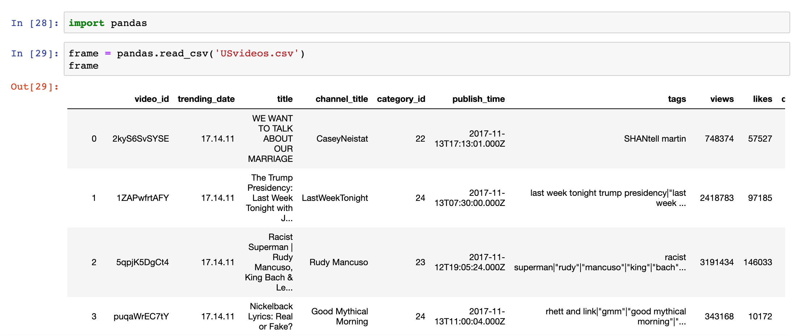

## How Python Programmers Earning 500K+ Annual Salary Write Code

### Why Write Code in Python

#### No Comparison, No Contrast

> **Many internet and mobile internet companies prioritize development efficiency over execution efficiency**.

##### Example 1: hello, world

C version:

```C
#include <stdio.h>

int main() {
    printf("hello, world\n");
    return 0;
}
```

Java version:

```Java
class Example01 {

    public static void main(String[] args) {
        System.out.println("hello, world");
    }
}
```

Python version:

```Python
print('hello, world')
```

#####  Example 2: Sum from 1 to 100

C version:

```C
#include <stdio.h>

int main() {
    int total = 0;
    for (int i = 1; i <= 100; ++i) {
        total += i;
    }
    printf("%d\n", total);
	return 0;
}
```

Python version:

```Java
print(sum(range(1, 101)))
```

##### Example 3: Creating and Initializing an Array (List)

Java version:

```Java
import java.util.Arrays;

public class Example03 {

    public static void main(String[] args) {
        boolean[] values = new boolean[10];
        Arrays.fill(values, true);
        System.out.println(Arrays.toString(values));

        int[] numbers = new int[10];
        for (int i = 0; i < numbers.length; ++i) {
            numbers[i] = i + 1;
        }
        System.out.println(Arrays.toString(numbers));
    }
}
```

Python version:

```Python
values = [True] * 10
print(values)
numbers = [x for x in range(1, 11)]
print(numbers)
```

##### Example 4: Random Number Selection for a Lottery

Java version:

```Java
import java.util.List;
import java.util.ArrayList;
import java.util.Collections;
import java.util.Scanner;

class Example03 {

    /**
     * Generate a random integer in the range [min, max)
     */
    public static int randomInt(int min, int max) {
        return (int) (Math.random() * (max - min) + min);
    }

    /**
     * Display a set of lottery numbers
     */
    public static void display(List<Integer> balls) {
        for (int i = 0; i < balls.size(); ++i) {
            System.out.printf("%02d ", balls.get(i));
            if (i == balls.size() - 2) {
                System.out.print("| ");
            }
        }
        System.out.println();
    }

    /**
     * Generate a set of random numbers
     */
    public static List<Integer> generate() {
        List<Integer> redBalls = new ArrayList<>();
        for (int i = 1; i <= 33; ++i) {
            redBalls.add(i);
        }
        List<Integer> selectedBalls = new ArrayList<>();
        for (int i = 0; i < 6; ++i) {
            selectedBalls.add(redBalls.remove(randomInt(0, redBalls.size())));
        }
        Collections.sort(selectedBalls);
        selectedBalls.add(randomInt(1, 17));
        return selectedBalls;
    }

    public static void main(String[] args) {
        try (Scanner sc = new Scanner(System.in)) {
            System.out.print("How many sets to generate: ");
            int num = sc.nextInt();
            for (int i = 0; i < num; ++i) {
                display(generate());
            }
        }
    }
}
```

Python version:

```Python
from random import randint, sample


def generate():
    """Generate a set of random numbers"""
    red_balls = [x for x in range(1, 34)]
    selected_balls = sample(red_balls, 6)
    selected_balls.sort()
    selected_balls.append(randint(1, 16))
    return selected_balls


def display(balls):
    """Display a set of lottery numbers"""
    for index, ball in enumerate(balls):
        print(f'{ball:0>2d}', end=' ')
        if index == len(balls) - 2:
            print('|', end=' ')
    print()


num = int(input('How many sets to generate: '))
for _ in range(num):
    display(generate())
```

> **Friendly reminder**: Cherish life and stay away from all forms of gambling.

##### Example 5: Implementing a Simple HTTP Server

Java version:

> **Note**: Before JDK 1.6, this had to be implemented through socket programming, which could be done using either multithreading or NIO. After JDK 1.6, you can use the `HttpServer` class provided by the `com.sun.net.httpserver` package.

```Java
import com.sun.net.httpserver.HttpExchange;
import com.sun.net.httpserver.HttpHandler;
import com.sun.net.httpserver.HttpServer;

import java.io.IOException;
import java.io.OutputStream;
import java.net.InetSocketAddress;

class Example05 {

    public static void main(String[] arg) throws Exception {
        HttpServer server = HttpServer.create(new InetSocketAddress(8000), 0);
        server.createContext("/", new RequestHandler());
        server.start();
    }

    static class RequestHandler implements HttpHandler {

        @Override
        public void handle(HttpExchange exchange) throws IOException {
            String response = "<h1>hello, world</h1>";
            exchange.sendResponseHeaders(200, 0);
            try (OutputStream os = exchange.getResponseBody()) {
                os.write(response.getBytes());
            }
        }
    }
}
```

Python version:

```Python
from http.server import HTTPServer, SimpleHTTPRequestHandler


class RequestHandler(SimpleHTTPRequestHandler):

    def do_GET(self):
        self.send_response(200)
        self.end_headers()
        self.wfile.write('<h1>hello, world</h1>'.encode())


server = HTTPServer(('', 8000), RequestHandler)
server.serve_forever()
```

or

```Python
python3 -m http.server 8000
```

#### What Can One Line of Python Code Do

> **Many times, your problem can be solved with just one line of Python code**.

```Python
# One-liner to implement a factorial function
fac = lambda x: __import__('functools').reduce(int.__mul__, range(1, x + 1), 1)

# One-liner to implement a greatest common divisor function
gcd = lambda x, y: y % x and gcd(y % x, x) or x

# One-liner to implement a prime number checker
is_prime = lambda x: x > 1 and not [f for f in range(2, int(x ** 0.5) + 1) if x % f == 0]

# One-liner to implement quicksort
quick_sort = lambda items: len(items) and quick_sort([x for x in items[1:] if x < items[0]]) + [items[0]] + quick_sort([x for x in items[1:] if x > items[0]]) or items

# Generate a FizzBuzz list
['Fizz'[x % 3 * 4:] + 'Buzz'[x % 5 * 4:] or x for x in range(1, 101)]
```

#### Design Patterns Have Never Been This Simple

> **Python is a dynamically typed language, and many design patterns are simplified or weakened in Python**.

Think about it: how to optimize the following code.

```Python
def fib(num):
    if num in (1, 2):
        return 1
    return fib(num - 1) + fib(num - 2)
```

The Proxy pattern can be implemented in Python using built-in or custom decorators.

```Python
from functools import lru_cache


@lru_cache()
def fib(num):
    if num in (1, 2):
        return 1
    return fib(num - 1) + fib(num - 2)


for n in range(1, 121):
    print(f'{n}: {fib(n)}')
```

> **Note**: By using the `lru_cache` decorator from Python's standard library `functools` module, we add a caching proxy to the `fib` function that caches intermediate results, optimizing the code's performance.

The Singleton pattern can be implemented in Python using custom decorators or metaclasses.

```Python
from functools import wraps
from threading import RLock


def singleton(cls):
    instances = {}
    lock = RLock()

    @wraps(cls)
    def wrapper(*args, **kwargs):
        if cls not in instances:
            with lock:
                if cls not in instances:
                    instances[cls] = cls(*args, **kwargs)
        return instances[cls]
```

> **Note**: Any class that needs to implement the Singleton pattern just needs to add the decorator above.

The Prototype pattern can be implemented in Python using metaclasses.

```Python
import copy


class PrototypeMeta(type):

    def __init__(cls, *args, **kwargs):
        super().__init__(*args, **kwargs)
        cls.clone = lambda self, is_deep=True: \
            copy.deepcopy(self) if is_deep else copy.copy(self)
```

> **Note**: By using a metaclass to add a `clone` method to any class that specifies `metaclass=PrototypeMeta`, object cloning is achieved. It leverages `copy` and `deepcopy` from Python's standard library `copy` module to implement shallow copy and deep copy respectively.

#### Data Collection and Data Analysis Have Never Been This Simple

> **Web data collection is one of Python's strongest areas.**

Example: Scraping Douban's "Top 250" movies.

```Python
import random
import time

import requests
from bs4 import BeautifulSoup

for page in range(10):
    resp = requests.get(
        url=f'https://movie.douban.com/top250?start={25 * page}',
        headers={'User-Agent': 'BaiduSpider'}
    )
    soup = BeautifulSoup(resp.text, "lxml")
    for elem in soup.select('a > span.title:nth-child(1)'):
        print(elem.text)
    time.sleep(random.random() * 5)
```

> **Data analysis and visualization can be easily accomplished with NumPy, Pandas, and Matplotlib**.



### The Right Way to Write Python Code

> **When writing Python code, you should write Pythonic code**.

#### Tip 1: The Right Way to Write Conditional Statements

Code from cross-language developers:

```Python
name = 'jackfrued'
fruits = ['apple', 'orange', 'grape']
owners = {'name': '骆昊', 'age': 40, 'gender': True}
if name != '' and len(fruits) > 0 and len(owners.keys()) > 0:
    print('Jackfrued love fruits.')
```

Pythonic code:

```Python
name = 'jackfrued'
fruits = ['apple', 'orange', 'grape']
owners = {'name': '骆昊', 'age': 40, 'gender': True}
if name and fruits and owners:
    print('Jackfrued love fruits.')
```

#### Tip 2: The Right Way to Swap Two Variables

Code from cross-language developers:

```Python
temp = a
a = b
b = temp
```

or

```Python
a = a ^ b
b = a ^ b
a = a ^ b
```

Pythonic code:

```Python
a, b = b, a
```


#### Tip 3: The Right Way to Build a String from a Sequence

Code from cross-language developers:

```Python
chars = ['j', 'a', 'c', 'k', 'f', 'r', 'u', 'e', 'd']
name = ''
for char in chars:
    name += char
```

Pythonic code:

```Python
chars = ['j', 'a', 'c', 'k', 'f', 'r', 'u', 'e', 'd']
name = ''.join(chars)
```


#### Tip 4: The Right Way to Iterate Over a List

Code from cross-language developers:

```Python
fruits = ['orange', 'grape', 'pitaya', 'blueberry']
index = 0
for fruit in fruits:
    print(index, ':', fruit)
    index += 1
```

Pythonic code:

```Python
fruits = ['orange', 'grape', 'pitaya', 'blueberry']
for index, fruit in enumerate(fruits):
    print(index, ':', fruit)
```


#### Tip 5: The Right Way to Create a List

Code from cross-language developers:

```Python
data = [7, 20, 3, 15, 11]
result = []
for i in data:
    if i > 10:
        result.append(i * 3)
```

Pythonic code:

```Python
data = [7, 20, 3, 15, 11]
result = [num * 3 for num in data if num > 10]
```


#### Tip 6: The Right Way to Ensure Code Robustness

Code from cross-language developers:

```Python
data = {'x': '5'}
if 'x' in data and isinstance(data['x'], (str, int, float)) \
        and data['x'].isdigit():
    value = int(data['x'])
    print(value)
else:
    value = None
```

Pythonic code:

```Python
data = {'x': '5'}
try:
    value = int(data['x'])
    print(value)
except (KeyError, TypeError, ValueError):
    value = None
```


### Using Lint Tools to Check Your Code Style

Read the following code and see how many issues or violations of Python coding standards you can spot.

```Python
from enum import *

@unique
class Suite (Enum):
    SPADE, HEART, CLUB, DIAMOND = range(4)

class Card(object):
    def __init__(self,suite,face ):
        self.suite = suite
        self.face = face


    def __repr__(self):
        suites='♠♥♣♦'
        faces=['','A','2','3','4','5','6','7','8','9','10','J','Q','K']
        return f'{suites[self.suite.value]}{faces[self.face]}'

import random

class Poker(object):
    def __init__(self):
        self.cards =[Card(suite, face) for suite in Suite
            for face in range(1, 14)]
        self.current=0
    def shuffle (self):
        self.current=0
        random.shuffle(self.cards)
    def deal (self):
        card = self.cards[self.current]
        self.current+=1
        return card
    def has_next (self):
        if self.current<len(self.cards): return True
        return False

p = Poker()
p.shuffle()
print(p.cards)
```

#### Installing and Using PyLint

Pylint is a Python code analysis tool that checks for errors in Python code, looks for code that does not conform to coding style standards (the default style is PEP 8), and identifies potentially problematic code.

```Bash
pip install pylint
pylint [options] module_or_package
```

Pylint output format is as follows:

> module_name:line_number:column_number:    message_type    message

Message types include:

1. C - Convention: Code that violates Python coding conventions (PEP 8).
2. R - Refactor: Poorly written code that needs refactoring.
3. W - Warning: Issues in the code that do not affect execution.
4. E - Error: Issues in the code that affect execution.
5. F - Fatal: Errors that prevent Pylint from continuing to run.

Common parameters for the Pylint command:

1. `--disable=<msg ids>` or `-d <msg ids>`: Disable specified message types.
2. `--errors-only` or `-E`: Show only errors.
3. `--rcfile=<file>`: Specify a configuration file.
4. `--list-msgs`: List all Pylint messages.
5. `--generate-rcfile`: Generate a sample configuration file.
6. `--reports=<y_or_n>` or `-r <y_or_n>`: Whether to generate a check report.

### Using Profile Tools to Analyze Your Code Performance

#### The cProfile Module

`example01.py`

```Python
import cProfile


def is_prime(num):
    for factor in range(2, int(num ** 0.5) + 1):
        if num % factor == 0:
            return False
    return True


class PrimeIter:

    def __init__(self, total):
        self.counter = 0
        self.current = 1
        self.total = total

    def __iter__(self):
        return self

    def __next__(self):
        if self.counter < self.total:
            self.current += 1
            while not is_prime(self.current):
                self.current += 1
            self.counter += 1
            return self.current
        raise StopIteration()


cProfile.run('list(PrimeIter(10000))')
```

Execution result:

```
   114734 function calls in 0.573 seconds

   Ordered by: standard name

   ncalls  tottime  percall  cumtime  percall filename:lineno(function)
        1    0.006    0.006    0.573    0.573 <string>:1(<module>)
        1    0.000    0.000    0.000    0.000 example.py:14(__init__)
        1    0.000    0.000    0.000    0.000 example.py:19(__iter__)
    10001    0.086    0.000    0.567    0.000 example.py:22(__next__)
   104728    0.481    0.000    0.481    0.000 example.py:5(is_prime)
        1    0.000    0.000    0.573    0.573 {built-in method builtins.exec}
        1    0.000    0.000    0.000    0.000 {method 'disable' of '_lsprof.Profiler' objects}
```

####line_profiler

Add a `profile` decorator to the function you want to profile for time performance, and the execution count and time of each line of the function will be profiled.

`example02.py`

```Python
@profile
def is_prime(num):
    for factor in range(2, int(num ** 0.5) + 1):
        if num % factor == 0:
            return False
    return True


class PrimeIter:

    def __init__(self, total):
        self.counter = 0
        self.current = 1
        self.total = total

    def __iter__(self):
        return self

    def __next__(self):
        if self.counter < self.total:
            self.current += 1
            while not is_prime(self.current):
                self.current += 1
            self.counter += 1
            return self.current
        raise StopIteration()


list(PrimeIter(1000))
```

Install and use the `line_profiler` third-party library.

```Bash
pip install line_profiler
kernprof -lv example.py

Wrote profile results to example02.py.lprof
Timer unit: 1e-06 s

Total time: 0.089513 s
File: example02.py
Function: is_prime at line 1

 #      Hits         Time  Per Hit   % Time  Line Contents
==============================================================
 1                                           @profile
 2                                           def is_prime(num):
 3     86624      43305.0      0.5     48.4      for factor in range(2, int(num ** 0.5) + 1):
 4     85624      42814.0      0.5     47.8          if num % factor == 0:
 5      6918       3008.0      0.4      3.4              return False
 6      1000        386.0      0.4      0.4      return True
```

####memory_profiler

Add a `profile` decorator to the function you want to profile for memory usage, and the memory usage of each line of the function will be profiled.

`example03.py`

```Python
@profile
def eat_memory():
    items = []
    for _ in range(1000000):
        items.append(object())
    return items


eat_memory()
```

Install and use the `memory_profiler` third-party library.

```Python
pip install memory_profiler
python3 -m memory_profiler example.py

Filename: example03.py

Line #    Mem usage    Increment   Line Contents
================================================
     1   38.672 MiB   38.672 MiB   @profile
     2                             def eat_memory():
     3   38.672 MiB    0.000 MiB       items = []
     4   68.727 MiB    0.000 MiB       for _ in range(1000000):
     5   68.727 MiB    1.797 MiB           items.append(object())
     6   68.727 MiB    0.000 MiB       return items
```

### How to Build Well-Rounded Professional Skills

#### Learning Summary

1. Understand the big picture
2. Define the scope
3. Set objectives
4. Find resources
5. Create a learning plan
6. Filter resources
7. Start learning, just enough to get going (YAGNI)
8. Get hands-on, learn by doing
9. Master it fully, apply what you learn
10. Teach others, achieve thorough understanding

#### Time Management

1. Improve your focus

2. Make full use of fragmented time

3. Use the Pomodoro Technique

4. How time gets wasted

5. Any action is better than no action

   


#### Recommended Books

1. Career planning: *Soft Skills: The Software Developer's Life Manual*
2. Wu Jun's series: *On the Edge*, *The Mystery of Silicon Valley*, *The Beauty of Mathematics*, ...
3. Time management: *Becoming a More Efficient Person*, *Pomodoro Technique Illustrated*