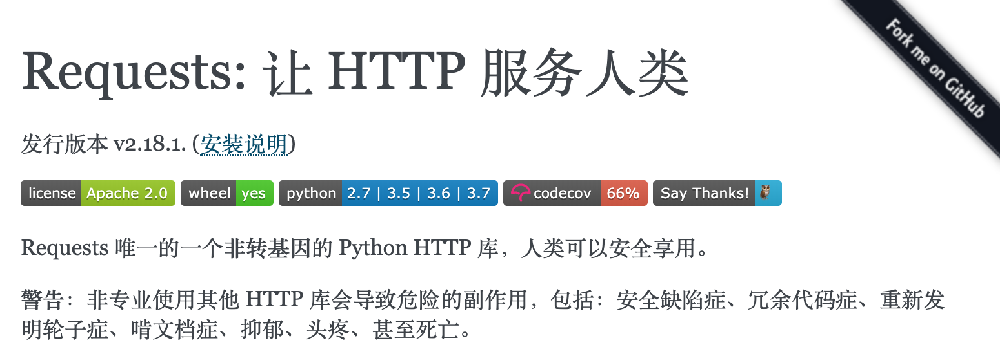

## Fun with Python

Since the code below is all very simple, simple enough to be completed directly in Python's interactive environment. Of course, the official Python interactive environment is not very user-friendly, so it is recommended to use ipython. You can install ipython using the command below, and after a successful installation, type the ipython command to enter the interactive environment.

```Shell
pip install ipython
```

or

```Shell
pip3 install ipython
```

The most intuitive advantages of ipython:

1. You can use ? or ?? to get help.
2. You can use ! to call system commands.
3. You can use the Tab key for auto-completion.
4. You can use magic commands, such as: %timeit.

### Edit Images with Code Even Without Tools

1. Install the pillow third-party library.

   PIL (Python Imaging Library) is the de facto standard library for image processing on the Python platform. PIL is very powerful, yet its API is very simple and easy to use. However, PIL only supports up to Python 2.7, and it has not been maintained for many years. So a group of volunteers created a compatible version based on PIL called [Pillow](https://github.com/python-pillow/Pillow), which supports Python 3.x and also adds many useful and interesting new features.

   ```Shell
   pip install pillow
   ```

   or

   ```Shell
   pip3 install pillow
   ```

2. Load an image.

   ```Python
   from PIL import Image

   chiling = Image.open('chiling.jpg')
   chiling.show()
   ```

3. Apply filters.

   ```Shell
   from PIL import ImageFilter

   chiling.filter(ImageFilter.EMBOSS).show()
   chiling.filter(ImageFilter.CONTOUR).show()
   ```

4. Crop and paste images.

   ```Python
   rect = 220, 690, 265, 740
   watch = chiling.crop(rect)
   watch.show()
   blured_watch = watch.filter(ImageFilter.GaussianBlur(4))
   chiling.paste(blured_watch, (220, 690))
   chiling.show()
   ```

5. Generate a mirror image.

   ```Python
   chiling2 = chiling.transpose(Image.FLIP_LEFT_RIGHT)
   chiling2.show()
   ```

6. Generate a thumbnail.

   ```Python
   width, height = chiling.size
   width, height = int(width * 0.4), int(height * 0.4)
   chiling.thumbnail((width, height))
   ```

7. Composite images.

   ```Python
   frame = Image.open('frame.jpg')
   frame.show()
   frame.paste(chiling, (210, 150))
   frame.paste(chiling2, (522, 150))
   frame.show()
   ```

The above knowledge is also covered in [Day 15](<https://github.com/jackfrued/Python-100-Days/blob/master/Day01-15/15.%E5%9B%BE%E5%83%8F%E5%92%8C%E5%8A%9E%E5%85%AC%E6%96%87%E6%A1%A3%E5%A4%84%E7%90%86.md>) of the [Python-100-Days](https://github.com/jackfrued/Python-100-Days) project.

### Send Greeting Videos to WeChat Friends in Bulk

1. Install the itchat third-party library.

   [itchat](<https://itchat.readthedocs.io/zh/latest/>) is an open-source WeChat personal account API. Calling WeChat with Python has never been this easy.

   ```Shell
   pip install itchat
   ```

   or

   ```Shell
   pip3 install itchat
   ```

2. Log in to WeChat.

   ```Python
   import itchat

   itchat.auto_login()
   ```

   > Note: Scan the QR code that appears on the screen with your WeChat to complete the login. You can only get your friend information and send messages to your friends after logging in.

3. Find your friends.

   ```Python
   friends_list = itchat.get_friends(update=True)
   print(len(friends_list))
   luohao = friends_list[0]
   props = ['NickName', 'Signature', 'Sex']
   for prop in props:
       print(luohao[prop])
   ```

   > Note: friends_list is essentially a list, and the first element in the list is yourself.

4. Randomly select 5 friends and get their usernames, nicknames, and signatures.

   ```Python
   lucky_friends = random.sample(friends_list[1:], 5)
   props = ['NickName', 'Signature', 'City']
   for friend in lucky_friends:
       for prop in props:
           print(friend[prop] or 'No information available')
       print('-' * 80)
   ```

5. Send a text message to a friend.

   ```Python
   itchat.send_msg('Desperately need a red envelope to save my fallen soul!!!', toUserName='@8e06606db03f0e28d0ff884083f727e6')
   ```

6. Send videos to lucky friends in bulk.

   ```Python
   lucky_friends = random.sample(friends_list[1:], 5)
   for friend in lucky_friends:
       username = friend['UserName']
       itchat.send_video('/Users/Hao/Desktop/my_test_video.mp4', toUserName=username)
   ```

There are many more things you can do with itchat. For example, if a friend sent you a message and then retracted it, and you want to see those retracted messages, itchat can do that (register a hook function to receive messages, see [this article on CSDN](<https://blog.csdn.net/enweitech/article/details/79585043>)). Another example: sometimes we want to know if a certain friend has deleted us or put us on their blocklist. This can also be done using itchat's group chat feature - non-friends and blocklisted users cannot be added to group chats, so the return value of the create group chat function can determine the relationship between you and a specified person.

### View Trending News Without a Client App

1. Install the requests library. (Click to view [official documentation](<https://2.python-requests.org/zh_CN/latest/>))

   

   ```Shell
   pip install requests
   ```

   or

   ```Shell
   pip3 install requests
   ```

2. Scrape news data or get news data through an API.

   ```Python
   import requests

   resp = requests.get('http://api.tianapi.com/allnews/?key=Please use your own applied Key&col=7&num=50')
   ```

   > Note: The above uses the data API provided by Tianxing Data. If needed, you can register at the [Tianxing Data](<https://www.tianapi.com/>) website. When calling the API, you need to fill in the key assigned to you by the system after successful registration.

3. Use deserialization to parse the JSON string into a dictionary and get the news list.

   ```Python
   import json

   newslist = json.loads(resp.text)['newslist']
   ```

4. Loop through the news list and find news of interest, for example: Huawei.

   ```Python
   for news in newslist:
       title = news['title']
       url = news['url']
       if 'Huawei' in title:
           print(title)
           print(url)
   ```

5. Call an SMS gateway to send a text message to your phone, notifying you of the news headline and providing a link.

   ```Python
   import re

   pattern = re.compile(r'https*:\/\/[^\/]*\/(?P<url>.*)')
   matcher = pattern.match(url)

   if matcher:
       url = matcher.group('url')
       resp = requests.post(
           url='http://sms-api.luosimao.com/v1/send.json',
           auth=('api', 'key-Please use your own applied Key'),
           data={
               'mobile': '13548041193',
               'message': f'Found a news article you might be interested in - {title}, click https://news.china.com/{url} for details. [Python Mini Course]'
           },
           timeout=10,
           verify=False
       )
   ```

   > Note: The above code uses the SMS gateway service provided by [Luosimao](<https://luosimao.com/>). Sending SMS through an SMS gateway requires payment, but most platforms provide a certain number of free test messages. Sending SMS must comply with platform rules, and non-compliant messages cannot be sent. The SMS template ("Found a news article you might be interested in - ###, click https://news.china.com/### for details.") and SMS signature ("[Python Mini Course]") used above need to be configured on the Luosimao management platform. If you are unsure how to configure them, you can contact the platform's customer service for assistance.
