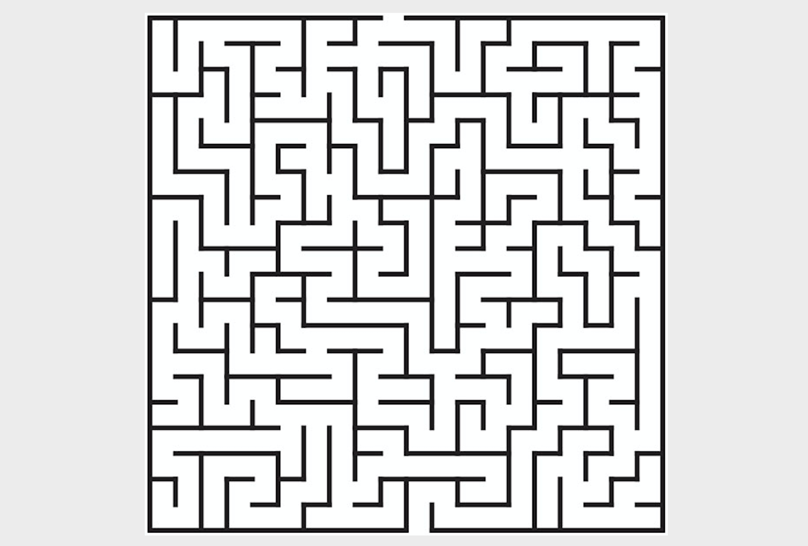

## Introduction to Algorithms Series 2 - The Other Side of the Water

In the first open lecture, we talked about exhaustive search. Exhaustive search is also known as brute-force search, and the backtracking method we will discuss today is a type of brute-force search. Many of the algorithms we will cover next are more or less related to the concept of "recursion", so let's first talk about "recursion".

### Recursion in Real Life

Once upon a time, there was a mountain. On the mountain, there was a temple. In the temple, there was an old monk telling a story to a young monk. What was the story? Once upon a time, there was a mountain. On the mountain, there was a temple. In the temple, there was an old monk telling a story to a young monk. What was the story? Once upon a time, there was a mountain. On the mountain, there was a temple. In the temple, there was an old monk telling a story to a young monk. What was the story? ...

Nobita Nobi is in his room, watching the future through the Time TV. On the TV screen, Nobita Nobi is in his room, watching the future through the Time TV. On the TV screen, Nobita Nobi is in his room, watching the future through the Time TV...

The recursive definition of factorial: $$0! = 1$$, $$n!=n*(n-1)!$$. Defining an object using the object itself is called a recursive definition.

The [Droste effect](https://zh.wikipedia.org/wiki/%E5%BE%B7%E7%BD%97%E6%96%AF%E7%89%B9%E6%95%88%E5%BA%94) is a visual form of recursion. The object held by the woman in the image contains a smaller picture of herself holding the same object, which in turn contains an even smaller picture of her holding the same object...


### Applications of Recursion

In programming, if a function calls itself directly or indirectly, we call it a recursive function.

There are two key points when writing recursive functions:

1. Convergence condition - When to stop the recursion.
2. Recursive formula - The relationship between each term and the previous term (or previous *N* terms).

Example 1: Calculate factorial.

```Python
def fac(num):
    if num == 0:
        return 1
    return num * fac(num - 1)
```

Python imposes a limit on recursion depth (default is 1000 levels of function calls). If you want to exceed this limit, you can use the following method.

```Python
import sys

sys.setrecursionlimit(10000)
```

Example 2: Climbing stairs - A staircase has *n* steps. You can take 1, 2, or 3 steps at a time. How many different ways are there to climb *n* steps?

```Python
def climb(num):
    if num == 0:
        return 1
    elif num < 0:
        return 0
    return climb(num - 1) + climb(num - 2) + climb(num - 3)
```

**Note**: The recursive function above will perform very poorly because the time complexity is exponential.

Optimized code.

```Python
from functools import lru_cache


@lru_cache()
def climb(num):
    if num == 0:
        return 1
    elif num < 0:
        return 0
    return climb(num - 1) + climb(num - 2) + climb(num - 3)
```

Code without using recursion.

```Python
def climb(num):
    a, b, c = 1, 2, 4
    for _ in range(num - 1):
        a, b, c = b, c, a + b + c
    return a
```

**Key takeaway**: When there is a better approach available, do not use recursion.

### Backtracking

**Backtracking** is a type of [brute-force search](https://zh.wikipedia.org/wiki/%E6%9A%B4%E5%8A%9B%E6%90%9C%E5%B0%8B%E6%B3%95). For certain computational problems, backtracking is a general algorithm that can find all (or some) solutions. It is especially suitable for constraint satisfaction problems (when solving constraint satisfaction problems, we incrementally build candidate solutions and abandon a partial candidate solution as soon as we determine it cannot be completed to a valid solution, along with all sub-candidates that extend from it, and then move on to test other partial candidates).

### Classic Examples

Example 1: **Maze Pathfinding**.



```Python
"""
Maze Pathfinding
"""
import random
import sys

WALL = -1
ROAD = 0

ROWS = 10
COLS = 10


def find_way(maze, i=0, j=0, step=1):
    """Navigate the maze"""
    if 0 <= i < ROWS and 0 <= j < COLS and maze[i][j] == 0:
        maze[i][j] = step
        if i == ROWS - 1 and j == COLS - 1:
            print('=' * 20)
            display(maze)
            sys.exit(0)
        find_way(maze, i + 1, j, step + 1)
        find_way(maze, i, j + 1, step + 1)
        find_way(maze, i - 1, j, step + 1)
        find_way(maze, i, j - 1, step + 1)
        maze[i][j] = ROAD


def reset(maze):
    """Reset the maze"""
    for i in range(ROWS):
        for j in range(COLS):
            num = random.randint(1, 10)
            maze[i][j] = WALL if num > 7 else ROAD
    maze[0][0] = maze[ROWS - 1][COLS - 1] = ROAD


def display(maze):
    """Display the maze"""
    for row in maze:
        for col in row:
            if col == -1:
                print('■', end=' ')
            elif col == 0:
                print('□', end=' ')
            else:
                print(f'{col}'.ljust(2), end='')
        print()


def main():
    """Main function"""
    maze = [[0] * COLS for _ in range(ROWS)]
    reset(maze)
    display(maze)
    find_way(maze)
    print('No way out!!!')


if __name__ == '__main__':
    main()
```

**Note:** The code above generates the maze by randomly placing walls. For a better maze generation approach, see the article [*Simple Maze Generation Using Backtracking for Tile-Based Mazes*](<https://indienova.com/indie-game-development/generate-tile-based-maze-with-backtracking/>).

Example 2: **Knight's Tour** - In chess, a knight must visit every square on the board exactly once, following the knight's movement rules.


```Python
"""
Knight's Tour
"""
import sys

SIZE = 8


def display(board):
    """Display the board"""
    for row in board:
        for col in row:
            print(f'{col}'.rjust(2, '0'), end=' ')
        print()


def patrol(board, i=0, j=0, step=1):
    """Patrol"""
    if 0 <= i < SIZE and 0 <= j < SIZE and board[i][j] == 0:
        board[i][j] = step
        if step == SIZE * SIZE:
            display(board)
            sys.exit(0)
        patrol(board, i + 1, j + 2, step + 1)
        patrol(board, i + 2, j + 1, step + 1)
        patrol(board, i + 2, j - 1, step + 1)
        patrol(board, i + 1, j - 2, step + 1)
        patrol(board, i - 1, j - 2, step + 1)
        patrol(board, i - 2, j - 1, step + 1)
        patrol(board, i - 2, j + 1, step + 1)
        patrol(board, i - 1, j + 2, step + 1)
        board[i][j] = 0


def main():
    """Main function"""
    board = [[0] * SIZE for _ in range(SIZE)]
    patrol(board)


if __name__ == '__main__':
    main()
```

Example 3: **Eight Queens** - How can eight queens be placed on an 8x8 chessboard so that no queen can directly attack any other queen? To achieve this, no two queens can be on the same row, column, or diagonal.


**Note**: This problem is a true classic, and there are plenty of solutions available online. It is left for you to solve on your own.